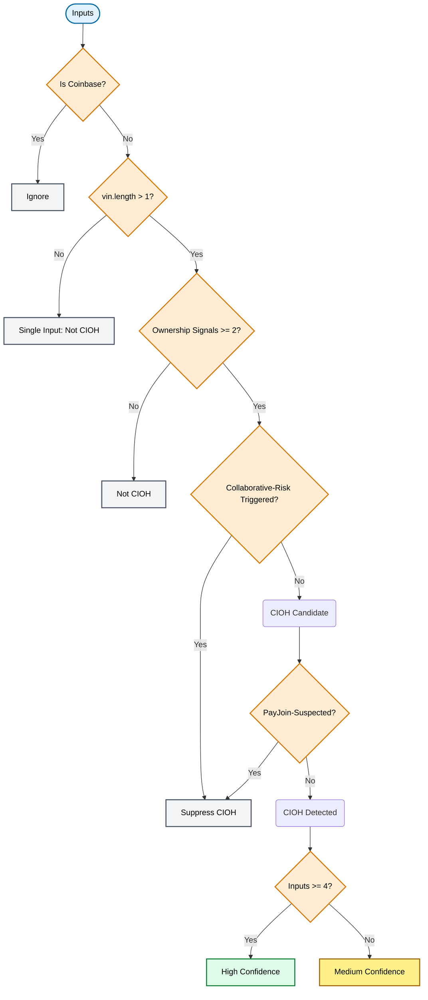
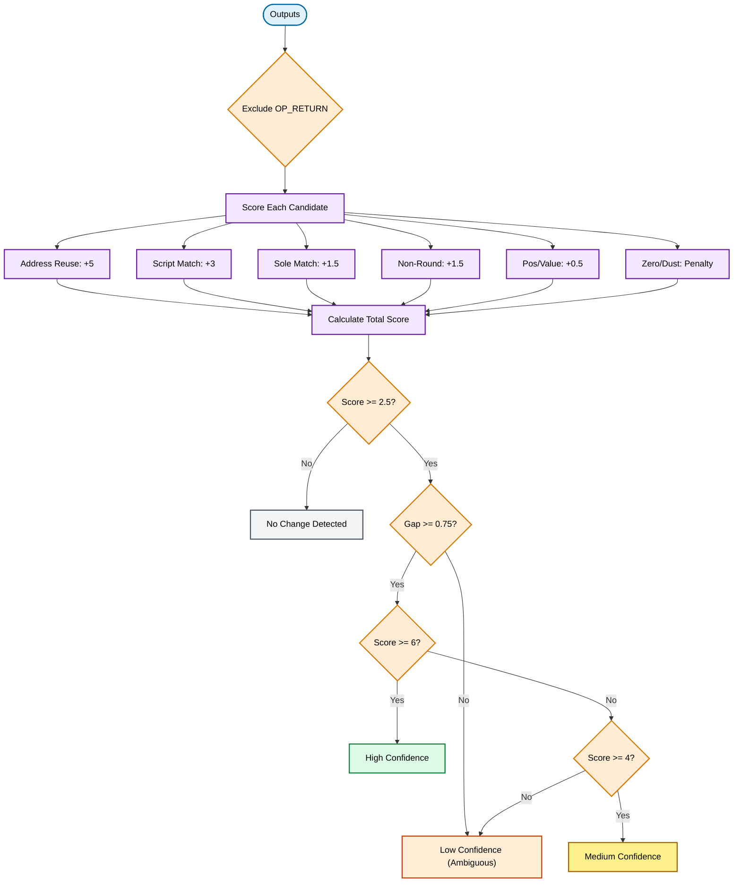
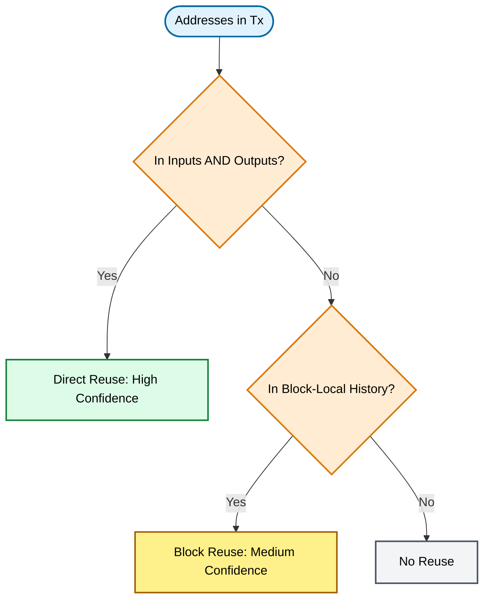
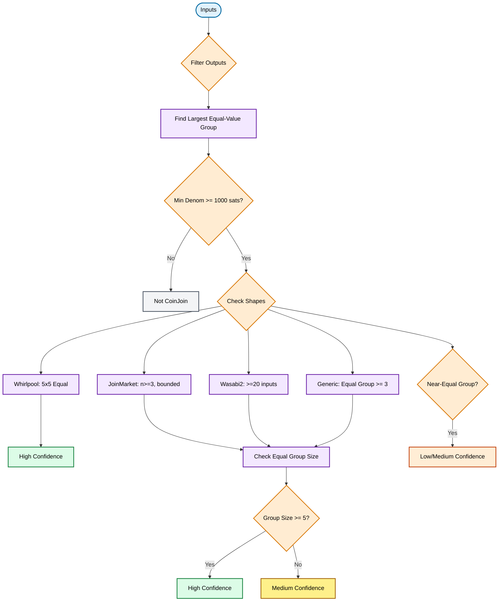
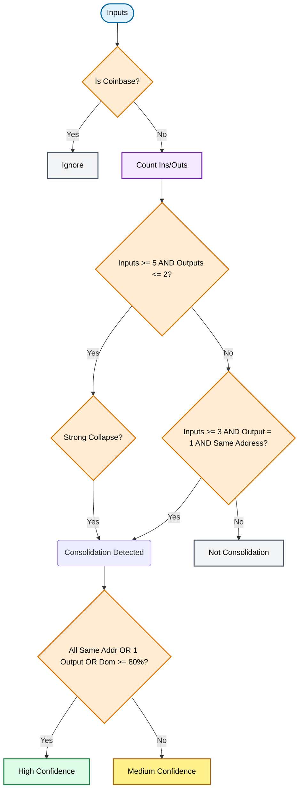
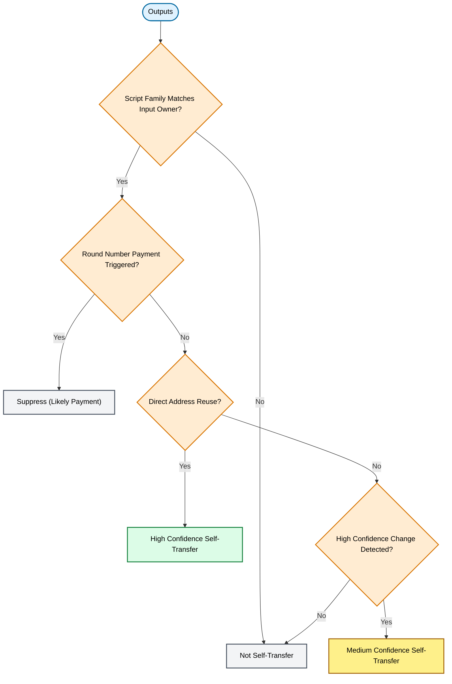
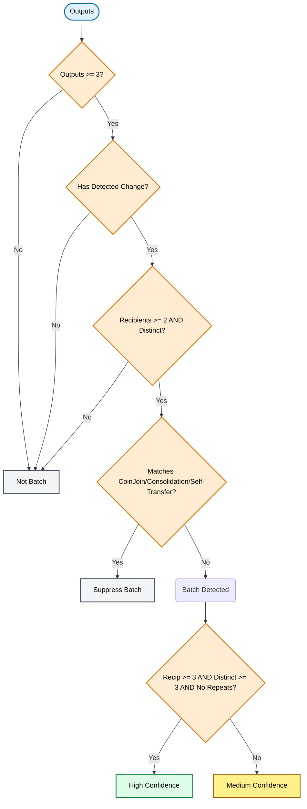
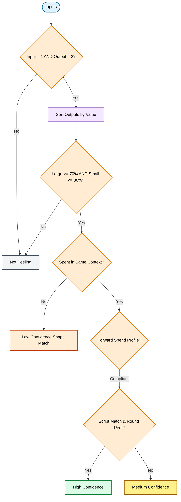
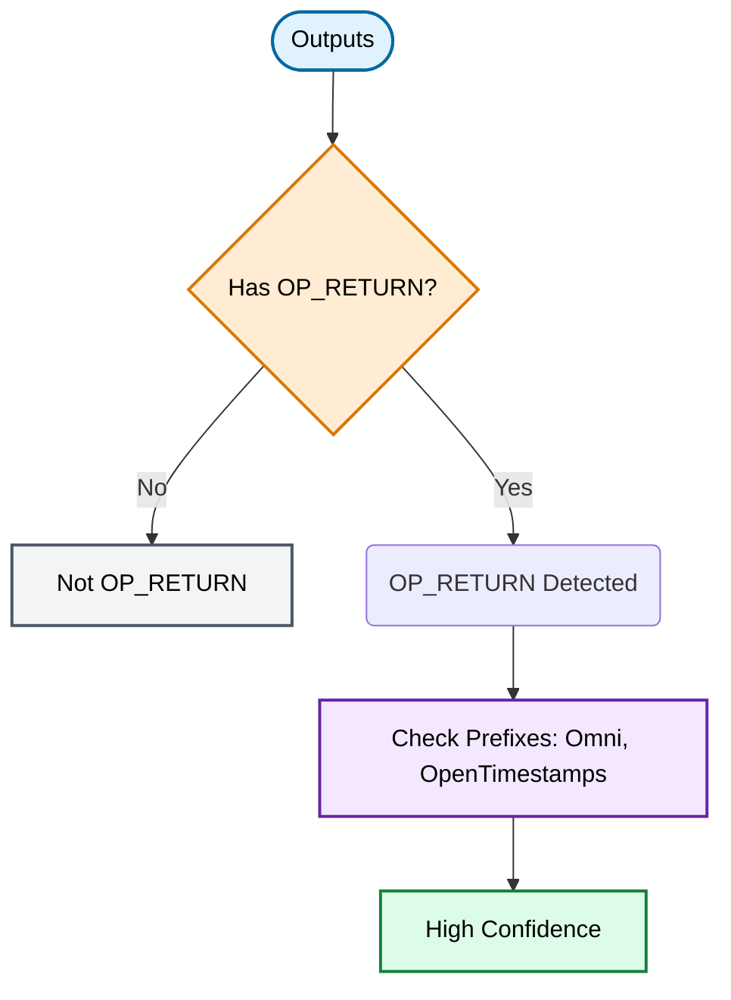
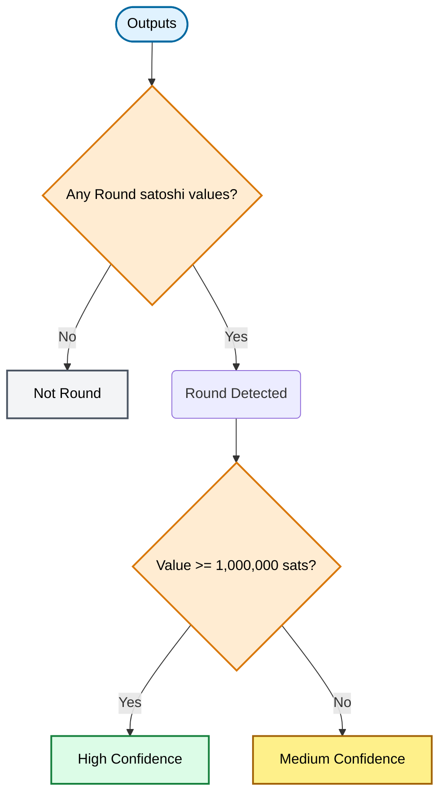

## How the Heuristics Work

This post documents the exact heuristics used to analyze Bitcoin transactions, why they were chosen, and where they can fail.

The implementation is intentionally rule-based: it tries to surface likely transaction patterns quickly, with explicit low/medium/high confidence tiers, rather than claiming perfect wallet attribution or deanonymization.

---

## Heuristics Implemented

### 1. Common Input Ownership Heuristic (CIOH)

**What it detects:**
This heuristic flags transactions where multiple non-coinbase inputs are spent together. The working assumption is that if a single transaction author can provide valid signatures for several inputs at once, those inputs are often controlled by the same wallet or entity.

**How it is detected/computed:**
The implementation in `detectCioh` uses a conservative gate instead of treating all multi-input transactions as ownership evidence. It records the input count, the number of distinct decoded input addresses, whether input prevout script families are mixed, whether RBF signaling is consistent across inputs, and whether any input address is repeated. CIOH is detected only when there are multiple inputs, at least two ownership signals (repeated input address, non-mixed input script families, RBF consistency), and no collaborative-spend risk flag. Collaborative-spend risk is raised for mixed input script families, inconsistent RBF signaling, or larger all-distinct input sets (3+ inputs with all unique addresses). CoinJoin-suspected transactions are fully suppressed at pipeline level, and PayJoin-suspected transactions also suppress CIOH to avoid forced single-owner attribution in collaborative-payment shapes.

**Logic Flow:**

**Example:**  
Transaction `a1b2c3...` has 3 inputs from addresses `1A...`, `1B...`, `1A...` (one repeated address), homogeneous input script families, and consistent RBF flags.  
Outputs: payment to `1D...` and change to `1E...`.  
Detection: ownership signals pass, collaborative-risk is not raised → detected with `medium` confidence.

**Confidence model:**
Confidence is implementation-defined rather than statistically calibrated. The code assigns `medium` confidence to multi-input transactions in general and upgrades to `high` when there are at least four inputs, because larger joint spends usually require stronger coordination.

**Limitations:**
Even with conservative gating, false positives remain possible for advanced collaborative constructions that avoid obvious mixed-ownership clues. False negatives also increase by design: some true same-owner multi-input transactions (especially all-distinct input sets) are now intentionally suppressed to reduce over-attribution risk. Single-input ownership clustering is out of scope, and coinbase transactions are excluded entirely.

---

### 2. Change Detection

**What it detects:**
This heuristic tries to identify which output in a transaction is the likely change output, meaning value that returns to the spender after the intended payment is made.

**How it is detected/computed:**
The implementation in `detectChangeDetection` scores every non-`OP_RETURN` output in transactions that have at least two spendable outputs. The scorer combines the following signals:

| Signal | Score Delta | Rationale |
| :--- | :--- | :--- |
| **Address Reuse** | `+5` | Direct input-to-output address reuse is the strongest ownership signal. |
| **Script Type Match** | `+3` | Output script type matches an input ownership-compatible script family. |
| **Sole Type Match** | `+1.5` | Bonus when exactly one candidate matches the input ownership family set. |
| **Non-Round Value** | `+1.5` | Change is often a residual non-round number after payment. |
| **Output Position** | `+0.5` | Legacy wallets often place change last (suppressed if BIP 69 detected). |
| **Value Pattern** | `+0.5` | Change is often materially smaller than total input value. |
| **Zero Value** | `-10` | Zero-valued outputs are heavily penalized (likely data carriers). |
| **Dust Output** | `-2` | Dust-like outputs are penalized as unlikely change (attack vectors). |

The highest-scoring candidate wins if its score is at least `2.5`. If it does not beat the runner-up by at least `0.75`, the selection is marked as ambiguous and assigned `low` confidence. The reported `method` is the highest-priority reason among address reuse, script-type match, sole-type match, round-number analysis, output position, and value pattern.

**Logic Flow:**

**Example:**  
Transaction `d4e5f6...` has one input from `1A...` (1.0 BTC).
* Output 0: 0.3 BTC to `1B...` (recipient)
* Output 1: 0.6999 BTC to `1C...` (change)
Scoring: Output 1 gets `+3` (script match), `+1.5` (sole type match), `+1.5` (non-round), `+0.5` (last position), and `+0.5` (value pattern) = `7.0`.  
Detection: Wins with score `7.0`, gap `>0.75` → detected, confidence `high` (score 7.0). Method likely `script_type_match`.

**Confidence model:**
Confidence is derived directly from the final score. Scores of `6` or more are labeled `high`, scores of `4` to below `6` are `medium`, and lower accepted scores are `low`. This is a rule-based confidence tier, not an empirical probability.

**Limitations:**
This heuristic is sensitive to wallet conventions. Wallets that randomize output ordering, avoid address reuse, or create multiple change-like outputs can reduce accuracy. Equal-valued outputs, batching, PayJoin-like flows, and privacy-preserving spend patterns can all create ambiguous candidates. The scorer is intentionally lightweight, so it favors speed and explainability over exhaustive wallet fingerprinting.

---

### 3. Address Reuse Detection

**What it detects:**
This section documents the address reuse heuristic. It flags transactions where an address appears on both sides of the same transaction, or where addresses used by the transaction already appear multiple times in the block-local context.

**How it is detected/computed:**
The implementation in `detectAddressReuse` builds sets of input and output addresses, computes direct overlap between them, and also checks a block-level address frequency map built by `buildBlockContext`. If an address is reused within the same transaction or appears more than once across the parsed block context, the heuristic is marked as detected.

**Logic Flow:**

**Example (within transaction):**  
Transaction `g7h8i9...` spends from `1A...` and sends back to `1A...` (same address).  
Detection: Direct overlap → detected, confidence `high`.

**Example (block-local reuse):**  
In the same block, address `1B...` appears in another transaction's input and also in this transaction's output (but not both sides of this tx).  
Detection: Block reuse detected, confidence `medium`.

**Confidence model:**
Confidence is `high` when the same address appears in both inputs and outputs of the same transaction, because that is a strong local reuse signal. It is `medium` when the only evidence is repeated appearance within the block-local frequency table.

**Limitations:**
The frequency model is local to the currently parsed block set, not the entire chain, so it can miss broader historical reuse and can also overemphasize repetition inside a small sample. Some output types do not decode cleanly to addresses, which reduces visibility. Shared service wallets and exchange infrastructure can also create reuse that does not map neatly to a single end user.

---

### 4. CoinJoin Detection

**What it detects:**
This heuristic looks for transactions that resemble CoinJoin-style collaborative spends, especially transactions with many inputs and many equal-valued outputs.

**How it is detected/computed:**
The implementation in `detectCoinjoin` filters out `OP_RETURN` outputs, counts repeated output values, and finds the largest exact equal-value group. It also computes a near-equal group using a `2%` tolerance window, but only uses that relaxed grouping when exact equality is too weak. Detection requires a plausible denomination floor of at least `1,000` sats and then accepts one of several structural shapes.

The base shapes remain: a classic large CoinJoin shape (at least five inputs, five spendable outputs, and an equal-output group of at least three), an all-outputs-equal shape, or an all-outputs-near-equal shape. On top of that, the detector now adds protocol-inspired fingerprints:

- `whirlpool_like`: exact `5x5` shape with equal spendable outputs, distinct participant-looking inputs/outputs, and input values plausibly in the `d..d+ε` pre-mix corridor.
- `joinmarket_like`: a repeated-denomination group that estimates participants (`n >= 3`) with total spendable outputs bounded by the expected post-mix-plus-change envelope (`<= 2n`) and distinct output destinations.
- `wasabi2_like`: large rounds (`>= 20` inputs) with substantial standardized-denomination reuse across outputs.

To reduce false positives from large fan-in service activity, the detector also computes input/output address-reuse ratios and applies a conservative suppression for very large candidate sets with excessive reuse (`> 70%`), except when a strong Whirlpool-style shape is present.

**Logic Flow:**

**Whirlpool-like example:**  
Transaction `j1k2l3...` has 5 inputs from distinct addresses, values `~100,000` ± small variance.  
Outputs: 5 outputs each exactly `100,000` sats to new addresses.  
Detection: `whirlpool_like` fingerprint, confidence `high`.

**Generic example:**  
Transaction `m4n5o6...` has 6 inputs (distinct addresses, total 2.5 BTC) and 5 outputs: four of 0.5 BTC each, one change of 0.4999 BTC.  
Detection: Equal group of 4 outputs, confidence `medium` (group <5). No protocol fingerprint.

**Confidence model:**
Detected transactions receive confidence according to which signal fired. For exact-equality detections, confidence is `medium` by default and upgrades to `high` when the equal-output cohort reaches five or more outputs. Near-equality detections are intentionally lower confidence (`low`/`medium`). Strong Whirlpool-like `5x5` detections are upgraded to `high` confidence due to their tighter structure.

**Limitations:**
Not every repeated-denomination transaction is a CoinJoin. Exchanges, batched payouts, and sweeps can still collide with these rules, especially when script/address decoding is incomplete. Conversely, privacy-preserving variants can evade structural thresholds. The new protocol fingerprints and reuse suppressor reduce obvious false positives, but this remains structural screening rather than identity attribution.

---

### 5. Consolidation Detection

**What it detects:**
This heuristic identifies likely UTXO consolidation transactions, where many inputs are merged into one or two spendable outputs.

**How it is detected/computed:**
The implementation in `detectConsolidation` excludes coinbase transactions, ignores `OP_RETURN` outputs, and measures both output concentration and input homogeneity. It detects either a broad consolidation shape with at least five inputs and one or two spendable outputs where the outputs collapse strongly into one destination (either a single spendable output, a largest-output share of at least `65%`, or all inputs reusing the same address), or a tighter same-address sweep shape with at least three inputs, exactly one spendable output, and all decoded inputs sharing the same address. It also measures the dominant share of normalized input script families for confidence scoring.

**Logic Flow:**

**Example:**  
Transaction `p7q8r9...` has 10 inputs all from the same address `1A...`, total 5.2 BTC.  
Outputs: one output of 5.1999 BTC to `1B...`, and a tiny dust output.  
Detection: Inputs `≥5`, all same address → consolidation detected, confidence `high` (same address, single dominant output).

**Confidence model:**
Confidence is `high` when any strong consolidation clue is present: all inputs share the same address, the transaction collapses into a single spendable output, at least `80%` of inputs share the same normalized script family, or the largest spendable output carries at least `80%` of the spendable value. Otherwise, a detected case is labeled `medium`.

**Limitations:**
High-input transactions are not always consolidations. Some collaborative spends, exchange sweep flows, or smart batching strategies can look similar. The script-type dominance metric is coarse and does not prove common ownership by itself.

---

### 6. Self-Transfer Detection

**What it detects:**
This heuristic tries to identify transactions that are likely moving funds between addresses controlled by the same wallet rather than paying a third party.

**How it is detected/computed:**
The implementation in `detectSelfTransfer` operates on transactions with at least one spendable output. It checks whether every spendable output script family matches one of the input ownership-compatible script families (including migration patterns such as `p2sh-p2wpkh` → `p2wpkh` and `p2sh-p2wsh` → `p2wsh`), whether there is strong within-transaction address reuse, and whether change detection already produced a high-confidence result. It also suppresses detection when the round-number-payment heuristic is triggered, because obviously rounded outputs often look more like user-facing payments.

**Logic Flow:**

**Example (address reuse):**  
Transaction `s1t2u3...` spends from `1A...` and sends to `1A...` (direct reuse).  
Detection: `high` confidence self-transfer.

**Example (script family match):**  
Transaction `v4w5x6...` has one input from a `p2sh-p2wpkh` address. Outputs are two `p2wpkh` addresses (compatible migration). No address reuse, but change detection identifies one as change with high confidence. No round outputs.  
Detection: Self-transfer detected, confidence `medium`.

**Confidence model:**
Confidence is `high` when direct address reuse exists inside the transaction. If the case depends mainly on strong change-detection output and matching script families, the heuristic falls back to `medium`.

**Limitations:**
This heuristic depends on other heuristics, especially change detection and address reuse, so any weakness in those inputs propagates here. Wallets that rotate addresses aggressively can hide self-transfers, while exchange or service infrastructure can create patterns that look self-directed even when they are not.

---

### 6a. Batch Payment Classification Support

**What it detects:**
This supporting classifier tries to distinguish true multi-recipient payouts from the much broader set of transactions that merely have three or more outputs.

**How it is detected/computed:**
The implementation requires at least three spendable outputs, a likely change output already identified by change detection, at least two remaining recipient outputs, and multiple distinct recipient addresses. It treats round-number recipients as a strong signal, but it also allows non-round recipient sets whenever recipient fanout itself is strong enough. It further rejects cases where recipient denominations collapse into a repeated-value group larger than two, and it suppresses itself whenever CoinJoin, consolidation, or self-transfer signals are already active.

**Logic Flow:**

**Example:**  
Transaction `y7z8a9...` has one input from `1A...` (2.0 BTC).  
Outputs:  
* 0.523 BTC to `1B...`
* 0.612 BTC to `1C...`
* 0.475 BTC to `1D...`
* 0.3899 BTC to `1E...` (change, identified)
Detection: 3 recipients, distinct addresses, no repeated values → batch payment detected, confidence `high` (3 distinct recipients, no repeats). Round recipients not required.

**Confidence model:**
Confidence is `medium` by default and upgrades to `high` when there are at least three recipient outputs, at least three distinct recipient addresses, and no repeated recipient denominations.

**Limitations:**
This remains a structural classifier, not a service-identity detector. Exchange withdrawals, payroll systems, and other legitimate fan-out systems can still look identical on-chain.

---

### 7. Peeling Chain Detection

**What it detects:**
This heuristic looks for one-step peeling-chain behavior, where a transaction spends one input, creates one large carry-forward output and one smaller peeled output, and the large output is spent again soon after.

**How it is detected/computed:**
The implementation in `detectPeelingChain` only considers transactions with exactly one input and exactly two spendable outputs. It sorts outputs by value, checks that the larger output carries at least `70%` of the spendable value while the smaller output is at most `30%`, and then looks up whether the larger output is spent by another transaction using the `spend_by_outpoint` index built in `buildBlockContext`. It further validates continuation shape by requiring the immediate next spender, if visible in the same parsed context, to keep a peeling-like profile: exactly one non-coinbase input, between one and three spendable outputs, and a dominant carry-forward output worth at least `60%` of that next transaction's spendable value.

**Logic Flow:**

**Example:**  
* **Transaction A** `b1c2d3...`: one input from `1A...` (1.0 BTC).
  * Output 0: 0.85 BTC to `1B...` (carry)
  * Output 1: 0.1499 BTC to `1C...` (peel)
  * Detection: Shape matches (85% carry, ~15% peel). `spend_by_outpoint` shows output 0 spent in Transaction B in same block.
* **Transaction B** `e4f5g6...`: one input from `1B...` (0.85 BTC).
  * Outputs: 0.80 BTC to `1D...` (carry), 0.0499 BTC to `1E...` (peel).
  * Detection: Forward evidence present, script types consistent, peel value not perfectly round → confidence `medium`. If peel were exactly 0.15 BTC (round), confidence would be `high`.

**Confidence model:**
Detected cases are `low` confidence when only the current-transaction shape is present and no immediate forward spend is visible in the parsed context. Confidence is `medium` when a compatible forward spend is visible, and upgrades to `high` when that forward evidence is present plus the carried output script family matches the input script family and the peeled output value is round-number-like.

**Limitations:**
The biggest limitation is scope: if the next spend is not visible in the same parsed block context, the heuristic can still emit a low-confidence shape match without forward confirmation, which increases false-positive risk. Real peeling chains often continue across later blocks, so false negatives are also likely when continuation is simply outside the observed window.

---

### 8. OP_RETURN Detection

**What it detects:**
This heuristic flags transactions that include one or more `OP_RETURN` outputs, which usually means the transaction carries embedded metadata rather than spendable coins in that output.

**How it is detected/computed:**
The implementation in `detectOpReturn` filters outputs by `script_type === 'op_return'`, records their indexes, and includes any protocol hints inferred earlier by script parsing. The script layer recognizes simple payload prefixes for Omni and OpenTimestamps and otherwise reports `unknown`.

**Logic Flow:**

**Example:**  
Transaction `h7i8j9...` has one input from `1A...` (0.01 BTC).
* Output 0: `OP_RETURN` with payload starting `6f6d6e69` (Omni prefix) → protocol hint `omni`.
* Output 1: 0.0099 BTC to `1B...`.
Detection: `op_return` detected, confidence `high`, protocols: `["omni"]`.

**Confidence model:**
Confidence is always `high` once an `OP_RETURN` output is found, because the signal is directly observable from the locking script and does not require behavioral inference.

**Limitations:**
This heuristic says little about intent beyond metadata presence. Many `OP_RETURN` payloads are application-specific, and the protocol classifier only handles a small set of recognizable prefixes. Transactions can also carry protocol information without using `OP_RETURN`, which this heuristic will not capture.

---

### 9. Round Number Payment Detection

**What it detects:**
This heuristic marks transactions whose non-`OP_RETURN` outputs contain round satoshi values, which often correlate with human-entered payment targets or denomination-oriented activity.

**How it is detected/computed:**
The implementation in `detectRoundNumberPayment` filters out coinbase transactions, inspects each spendable output, and keeps the outputs for which `isRoundSatValue` returns true. It records sample indexes and values so the report can explain why the heuristic triggered.

**Logic Flow:**

**Example:**  
Transaction `k0l1m2...` has one input from `1A...` (0.5 BTC).
* Output 0: 0.25 BTC (25,000,000 sats, round) to `1B...`
* Output 1: 0.2499 BTC (change, non-round) to `1C...`
Detection: Round output present, value `≥1,000,000` sats → confidence `high`. Sample outputs: index 0, value 25000000.

**Confidence model:**
If any matching output is at least `1,000,000` sats, confidence is `high`; otherwise detected cases are labeled `medium`. The intuition is that larger rounded amounts are less likely to be incidental dust or fee artifacts.

**Limitations:**
Round amounts are common in normal user payments, but they also appear in exchange processing, batching, withdrawals, and denomination-based collaborative systems. The heuristic depends on the local definition of `isRoundSatValue`, so its behavior is only as good as that predicate. It is best used as a supporting clue rather than a standalone classifier.

---

## Validation and Testing Attempts

To verify the accuracy of the implemented heuristics against real-world data, several approaches were explored:

### 1. BlockSci Framework
- **Attempt**: Evaluated [BlockSci](https://github.com/citp/BlockSci) as a potential engine for high-performance blockchain analysis and verification.
- **Limitation**: The project is no longer actively maintained and has compatibility issues with current environments. Furthermore, it requires fully indexing data from a Bitcoin Core node, which was impractical for this lightweight setup.

### 2. External API Cross-Verification
- **Attempt**: Considered building a script to poll external APIs (e.g., `mempool.space` or `blockstream.info` privacy analysis tools) for each transaction to compare heuristic outputs.
- **Limitation**: This approach ran into strict **rate limits** on frequent API requests. Validating a large block sample continuously was not feasible without hitting these rate limits or investing in dedicated node access.

---

## Rationale for Thresholds

-   **Change Detection (2.5 min score)**: This threshold ensures at least one strong signal (e.g., script match + non-round value) is present before labeling an output as change, reducing noise from ambiguous multi-output transactions.
-   **Peeling Chain (70% / 30% split)**: This reflects the typical economic incentive in peeling chains to carry the majority of funds forward while peeling off a smaller spendable amount.
-   **Consolidation (65% dominance)**: This captures transactions where value is clearly collapsing into a single destination without requiring a strict 100% sweep, allowing for small change remnants.
-   **CoinJoin (2% tolerance)**: Allows for minor fee adjustments in equal-output groups without misclassifying standard payments.
-   **Round Number (1,000,000 sats)**: This threshold (0.01 BTC) ensures the amount carries meaningful economic value, ruling out small dust limits or fee-market adjusters that might incidentally form round figures, and aligns with typical user-facing fiat-equivalent magnitudes.

---

## References

### Bitcoin Improvement Proposals (BIPs)

- **[BIP 34](https://github.com/bitcoin/bips/blob/master/bip-0034.mediawiki)**: Block v2, Height in Coinbase. Used for recovering block height from the coinbase script.
- **[BIP 69](https://github.com/bitcoin/bips/blob/master/bip-0069.mediawiki)**: Lexicographical Indexing of Transaction Inputs and Outputs. Used for deterministic input/output ordering and the wallet-fingerprinting check used to suppress naive output-position bias.
- **[BIP 141](https://github.com/bitcoin/bips/blob/master/bip-0141.mediawiki)**: Segregated Witness (Consensus layer). Used for witness structure and weight/vbytes interpretation.
- **[BIP 341](https://github.com/bitcoin/bips/blob/master/bip-0341.mediawiki)**: Taproot (Consensus layer). Used for recognizing v1 witness programs and Taproot outputs.
- **[BIP 342](https://github.com/bitcoin/bips/blob/master/bip-0342.mediawiki)**: Tapscript. Relevant to Taproot script-path spending edge cases and policy nuance.
- **[BIP 67](https://github.com/bitcoin/bips/blob/master/bip-0067.mediawiki)**: Deterministic sorting for multisig public keys. Relevant to multisig pattern interpretation limits.

### Academic Research Papers

- **Gavenda et al.**, *[Analysis of Input-Output Mappings in Coinjoin Transactions with Arbitrary Values](https://arxiv.org/abs/2510.17284)*. In *Computer Security – ESORICS 2025*, Springer, 2025. Useful for post-mix consolidation effects, fee-aware mapping constraints, and large-round false-positive mitigation ideas.
- **Schnoering & Vazirgiannis**, *[Heuristics for Detecting CoinJoin Transactions on the Bitcoin Blockchain](https://arxiv.org/abs/2311.12491)*. *arXiv preprint arXiv:2311.12491*, 2023. Documents implementation-specific detection conditions across JoinMarket/Wasabi/Whirlpool.
- **Ghesmati et al.**, *[Unnecessary Input Heuristics & PayJoin Transactions](https://eprint.iacr.org/2022/589)*. *Cryptology ePrint Archive*, Report 2022/589, 2022. A formal treatment of CIOH (Common Input Ownership Heuristic) violations.
- **Deuber et al.**, *[CoinJoin in the Wild](https://www.dominique-schroeder.de/publications/2021_Coin_Join_In_The_Whild_Analysis_DASH.pdf)*. In *Computer Security – ESORICS 2021*, Springer, 2021. An empirical analysis of real-world CoinJoin usage and detection pitfalls.
- **Meiklejohn et al.**, *[A Fistful of Bitcoins: Characterizing Payments Among Men with No Names](https://doi.org/10.1145/2504730.2504747)*. In *Proceedings of the 2013 Internet Measurement Conference (IMC)*, ACM, 2013. Useful for common-input ownership and change-style clustering ideas.

### Technical Documentation & Wikis

- **[Bitcoin Wiki: Privacy](https://en.bitcoin.it/wiki/Privacy)**: An overview of Bitcoin privacy techniques, threat models, and the heuristics commonly used in chain analysis.
- **[Bitcoin Developer Documentation](https://developer.bitcoin.org/reference/transactions.html)**: Documentation for script templates, `OP_RETURN`, and standard output types.
- **[General CoinJoin Literature](https://en.bitcoin.it/wiki/CoinJoin)**: Wallet-analysis writeups describing equal-output pattern matching as a practical structural signal.
- **[JoinMarket Documentation](https://github.com/JoinMarket-Org/joinmarket-clientserver/tree/master/docs)**: Practical architecture and operating patterns for JoinMarket-style CoinJoins.
- **[Samourai Whirlpool Documentation](https://docs.samourai.io/whirlpool/whirlpool)**: Pool-based CoinJoin flow and denomination behavior.
- **[Wasabi Wallet CoinJoin Documentation](https://docs.wasabiwallet.io/using-wasabi/CoinJoin.html)**: Coordinator-based CoinJoin mechanics and practical user flow.
- **[Omni Layer Specification](https://github.com/OmniLayer/spec) & [OpenTimestamps](https://opentimestamps.org/)**: Protocol documentation for simple `OP_RETURN` payload prefix identification.
- **[PayJoin / P2EP Documentation](https://en.bitcoin.it/wiki/PayJoin) & [Bitcoin Optech: PayJoin Topic](https://bitcoinops.org/en/topics/payjoin/)**: Design notes and operational context for collaborative-spend patterns that intentionally violate naive common-input ownership assumptions in retail-shaped transactions.
