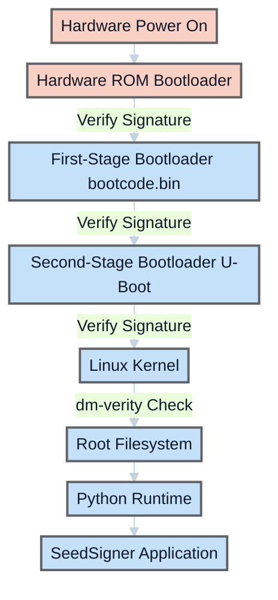
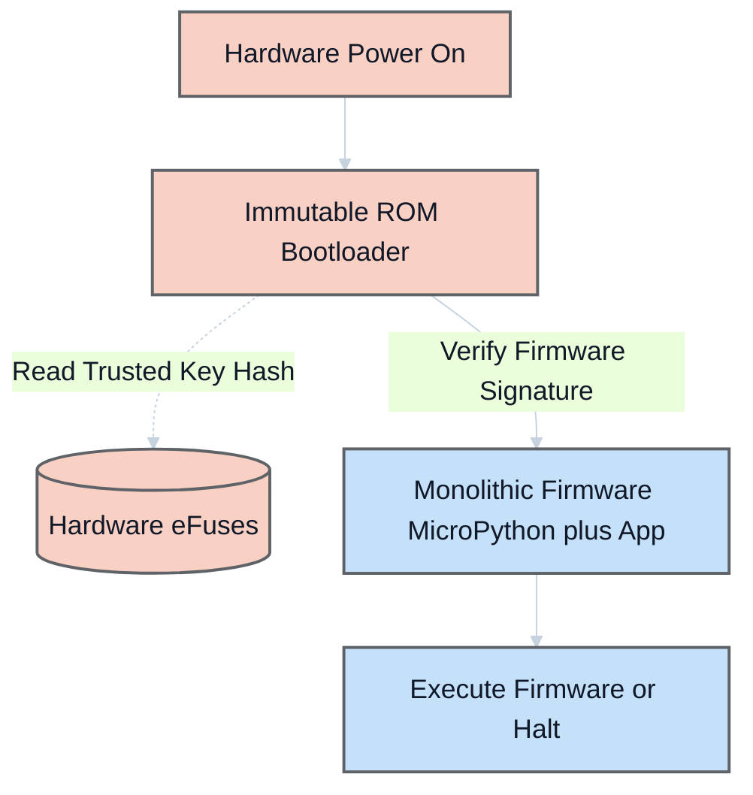

## How I came across the SeedSigner?
I briefly recall seeing SeedSigner when I was exploring the bitcoin.org website along with bunch of other hardware wallets. I didn't pay much attention to it at the time.

Fast forward now, the organisation SeedSigner is participating in the Summer of Bitcoin 2026, and I thought it would be a good opportunity to learn more about it.

It is quite a fascinating project. I had always understood that private keys should stay offline, but SeedSigner reframed that idea for me: offline is not only about where keys are stored, it is also about how signing workflows are designed end to end. That design philosophy is what made me want to explore SeedSigner in detail.

## How does the SeedSigner work?
At a high level, SeedSigner is software that runs on a Raspberry Pi Zero with a camera and display, turning inexpensive, off-the-shelf hardware into an air-gapped (no wifi, no bluetooth, no cellular) signing device. Critically, all seeds (read Chapter 4 of [Grokking Bitcoin](https://rosenbaum.se/book/) to recap the concept of seed, seed phrases and how they are used to derive private keys.) are held in RAM and completely erased when the device powers off, they never persist to disk.

The setup flow is straightforward:

1. Download the latest SeedSigner image from the official project resources.
2. Flash the image to a microSD card.
3. Insert the card into the Raspberry Pi Zero, connect the camera and screen, and boot the device.
4. Once booted, remove the microSD card.
5. Complete the on-device setup prompts.

### Seed Phrase Creation Options
Once running, SeedSigner offers multiple ways to generate or import seed phrases. The design goal remains constant: keep signing keys isolated from internet-connected devices. Here are the primary seed phrase creation methods:

#### 1. **Manual BIP39 Word Selection**
The most trust-minimized approach. You manually select BIP39 words and then use SeedSigner to calculate a valid final checksum word. In SeedSigner, the final-word workflow supports providing the remaining entropy bits via coin flips, manual final-word selection, or zeros before checksum calculation. This method offers maximum control but requires careful manual input. The result is either a 12-word or 24-word complete seed phrase.

#### 2. **Dice Rolls Conversion**
Convert physical randomness into a seed phrase through dice rolls. Roll dice multiple times (50 rolls for a 12-word phrase, 99 rolls for a 24-word phrase) and enter the results into SeedSigner. SeedSigner hashes the roll string (SHA256) and derives the mnemonic from that result. This method provides verifiable, user-controlled randomness and is documented as compatible with verification workflows using Ian Coleman's BIP39 tool and bitcoiner.guide/seed (with the correct input modes).

#### 3. **Camera-Based Image Entropy**
The most convenient method. Take a photograph using SeedSigner's built-in camera, and the device extracts entropy from:
- Pixels in the photograph
- Preview image frames rendered on screen after activation
- Raspberry Pi's unique serial number
- Timing-derived data during runtime

The aggregated randomness from these variables generates your seed phrase. While convenient, this method places the most trust in SeedSigner's code compared to other options.

#### 4. **Existing Seed Import**
Temporarily import an existing seed phrase via:
- Manual word-by-word entry through an optimized interface
- SeedQR scanning (a QR-encoded format of the seed phrase for quick loading)

### Seed Phrase Length and Passphrase Options

- **12-word vs. 24-word seeds**: A 24-word seed captures significantly more entropy mathematically, but in a multi-signature wallet with at least three cosigners, multiple 12-word seeds provide adequate entropy. When using QR transcription (SeedQR), 12-word seeds are less time-consuming.
- **BIP39 Passphrase support**: You can add an optional passphrase (sometimes called the "13th word" for 12-word seeds or "25th word" for 24-word seeds) that transforms the seed into a completely new private key. This provides an additional security layer against seed disclosure.

### SeedQR Transcription

After generating or importing a seed, SeedSigner provides a manual transcription interface to convert your seed into a SeedQR, a scannable QR code format. This single-frame QR code enables instant seed loading in the future without manual word entry, though the transcription process typically takes about 10 minutes. Importantly, your SeedQR should only be scanned by SeedSigner or other QR-enabled hardware signers, never by internet-connected devices.

The transaction flow typically looks like this:

1. Build an unsigned transaction in a software wallet such as Sparrow.
2. Export it as a PSBT (Partially Signed Bitcoin Transaction) QR, often an animated multi-frame code for larger transactions.
3. Scan that QR with SeedSigner, review critical details (amount, destination, and fees), and sign.
4. SeedSigner displays an animated QR containing the signed transaction.
5. Scan that QR back into the software wallet and broadcast it to the Bitcoin network.

{: .zoom }

Because data moves through QR codes rather than cables or radios, private key operations remain on the air-gapped signer. This sharply reduces attack surface while still allowing a practical day-to-day Bitcoin signing workflow.

You can look at how it is used in a multi-signature setup in the [SeedSigner Independent Custody Guide](https://github.com/SeedSigner/independent_custody_guide) for more details. The stateless design makes it practical to use a single SeedSigner for multiple independent keys in different multisig wallets, each power cycle leaves no trace of the previous seed.

## How secure is the SeedSigner?
Security is layered into almost every design decision in SeedSigner, from download to power-off:

1. **The download is verifiable via PGP and SHA256.** You import the project's public key from Keybase, run `gpg --verify` on the signature file, confirm a "Good signature" with a matching fingerprint, then run a `shasum` check on the image. The key fingerprint is also cross-published on Twitter, GitHub Gist, and SeedSigner.com for independent verification.

2. **Builds are reproducible from v0.7.0 onwards.** Anyone can build the image from source and confirm it is byte-for-byte identical to the official release, so trust in the maintainer is optional, not required.

3. **The SD card is removed after boot.** With no writable storage in the device, there is simply nowhere for secret data to be written, even if the card had been tampered with beforehand.

4. **Seeds exist only in RAM and vanish on power-off.** Nothing is ever written to disk. Remove the power, and the seed is gone, eliminating all physical-access attacks that target persistent storage.

5. **No wireless radios.** The recommended Pi Zero 1.3 has no WiFi or Bluetooth hardware at all. Data enters only via QR scan and leaves only via QR display. The air gap is physical, not just a software setting.

6. **Fully open-source, volunteer-maintained, no corporate profit motive.** The code can be audited by anyone. There is no closed firmware to hide behind.

7. **Transaction details are reviewed on-device before signing.** The destination address, amount, and fees are shown clearly on screen before you approve, so a compromised wallet app cannot silently manipulate what you sign.

### Current Pitfalls
 
The security properties above are genuine, but some meaningful gaps remain:
 
1. **No hardware-enforced secure boot.** The Raspberry Pi Zero has no secure boot mechanism. There is nothing in the hardware that cryptographically verifies the software before it runs. A sufficiently motivated attacker with physical access, even briefly, before the SD card is removed, could swap or modify the card and the device would boot the tampered image without complaint. The PGP verification step described above is done by *you*, on your computer, before flashing. Once the card is written and handed off, there is no further chain of trust at boot time.
 
2. **The SD card removal is a manual, trust-based step.** The setup guide instructs you to remove the SD card after booting, but nothing enforces this. A user who forgets, or a device that reaches someone who does not know the protocol, is a device with a live writable storage medium attached. The security of this step depends entirely on the operator.
 
3. **Linux is a large attack surface.** The Pi Zero runs a full Linux-based OS under the hood. For a device whose only job is to sign Bitcoin transactions, this is significant over-engineering. A full OS brings with it a large codebase, kernel drivers, and system processes, most of which are irrelevant to signing but all of which represent potential attack surface.
 
4. **The hardware itself is general-purpose.** The Raspberry Pi was designed as a general-purpose computing board, not a security device. It lacks the tamper-resistance, secure enclaves, and hardware key storage found in purpose-built security chips.

### The Hypothetical Fix: Securing the Linux Boot Chain

If the problem is that the Raspberry Pi Zero blindly trusts the SD card, the obvious patch seems to be: add hardware-backed secure boot to the Linux environment.

However, implementing this on a full operating system creates a massive and brittle chain of trust. Every layer must cryptographically verify the next layer before handing over execution:

Even if we moved to a board that had the required eFuse support, maintaining this entire chain is operationally complex. A routine OS update can invalidate signatures, and secure boot still protects only startup, not runtime behavior once Linux is fully loaded.

### The Adversary Model: Evil Maid with Temporary Physical Access

For an air-gapped signer, the relevant threat model is not broken cryptography. The realistic threat is a capable adversary who gains brief, undetected physical access to the device.

In the current architecture, that adversary can:

1. Swap a legitimate microSD card with an identical-looking card containing a modified image.
2. Wait for normal user boot and seed entry to occur on the compromised device.
3. Let the malicious image behave normally while subtly altering outbound QR data.
4. Exfiltrate sensitive seed-derived material when the signed QR is scanned by an online system.

Physical air-gapping and RAM-only key handling are powerful defenses, but they are undermined if untrusted code is allowed to execute before any hardware-enforced verification step.
 
### Where This Points
 
These pitfalls share a common thread: the current platform was not designed from the ground up with security as the primary constraint. It achieves strong security through careful software design and operational discipline, but the hardware offers no enforcement layer underneath.

Having built a custom 16-bit computer architecture from scratch with my [Vulcan-16](https://github.com/wolgwang1729/Vulcan-16) project (with the help of the Nand2Tetris course), I know firsthand how much functionality can be achieved directly at the bare-metal level. Vulcan-16 can execute a wide range of complex instructions without any underlying operating system, making it clear to me that running a full Linux OS is massive overkill just to process and sign Bitcoin transactions.

This is exactly why porting to a microcontroller is the logical next step. A microcontroller acts as the perfect middle ground between the immense headache of building a computer entirely from scratch and the bloated overhead of a full Linux environment. It provides the granular, low-level control of a scratch-built system while supplying a reliable, ready-to-use hardware foundation.

Because a microcontroller runs no OS, it has a drastically smaller codebase, boots in milliseconds directly into the application, and opens the door to building a proper secure bootloader, one that cryptographically verifies the firmware before execution. Equally, rethinking the storage model at this level could let the security guarantees of "no persistent storage" be enforced by the hardware itself, rather than relying on the user to remember to pull out an SD card.

Because there is no full Linux stack in this model, the chain of trust collapses into a single verifiable step: hardware verifies firmware before any application logic runs.

### My Next Steps: Simulating the Secure Bootloader

This hardware evolution is the direction I want to explore further for Summer of Bitcoin 2026. Running verified code from removable media on an MCU requires a strict boot state machine that validates authenticity before execution.

To de-risk that transition, I am building a standalone C proof of concept that simulates:

1. A hardware eFuse bank containing a trusted public key hash.
2. A firmware payload with attached key and signature metadata.
3. ROM-boot verification logic that either transfers control or halts.

By validating these boot-flow transitions in a controlled simulation first, I can establish concrete implementation requirements before moving to real microcontroller firmware.

 
## References

1. **SeedSigner Independent Custody Guide** by SeedSigner. Comprehensive guide covering multi-signature wallets, security considerations, device design rationale, and step-by-step wallet setup and transaction signing workflows. [Read online](https://github.com/SeedSigner/independent_custody_guide).
2. **SeedSigner GitHub Repository**, Project README and documentation. Technical specifications, hardware shopping list, software installation instructions, enclosure designs, and feature highlights. [Read online](https://github.com/SeedSigner/seedsigner/blob/dev/README.md).
3. **BIP 39, Mnemonic code for generating deterministic keys**. Defines the standard for seed phrases used in Bitcoin wallets. [Read BIP 39](https://github.com/bitcoin/bips/blob/master/bip-0039.mediawiki).
4. **Grokking Bitcoin** by Kalle Rosenbaum. An excellent visual guide to understanding Bitcoin's technical concepts. [Read online](https://rosenbaum.se/book/).